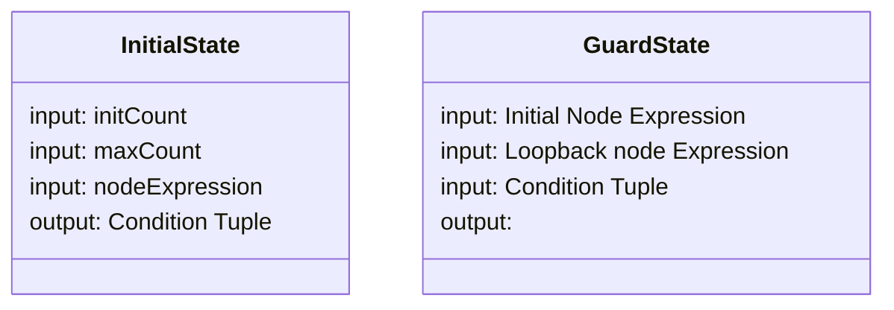

```mermaid
classDiagram
  class InitialState{
    input: initCount
    input: maxCount
    input: nodeExpression
    output: Condition Tuple
  }

  class GuardState{
    input: Initial Node Expression
    input: Loopback node Expression
    input<hidden>: Condition Tuple
    output: 
  }
```